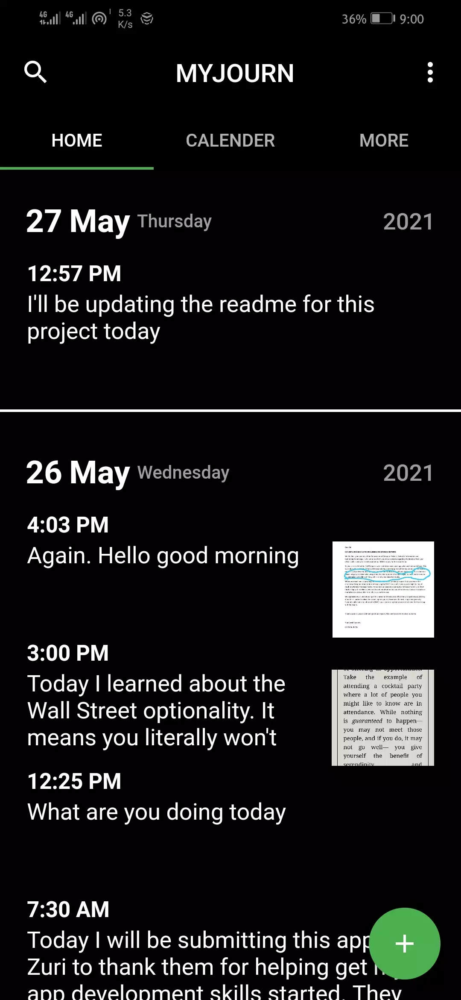
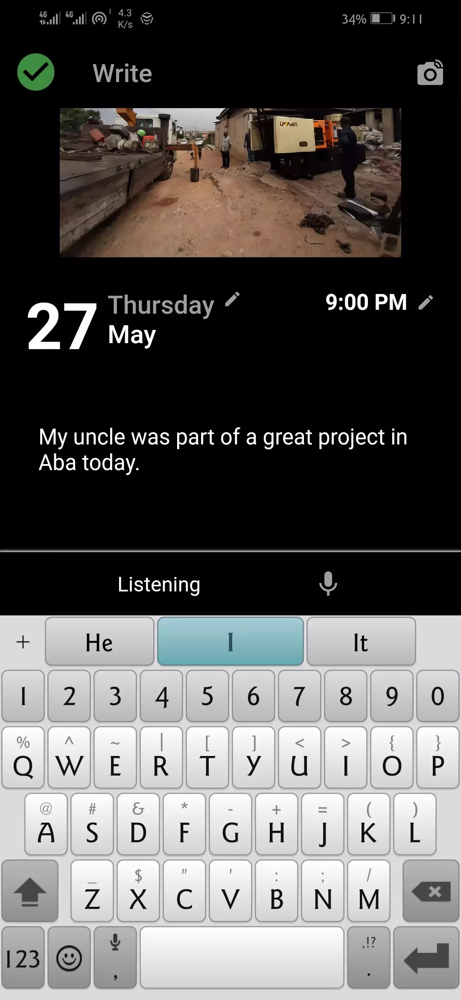
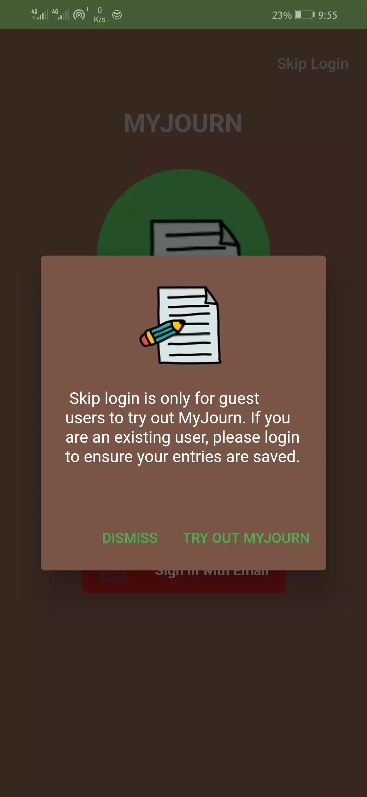
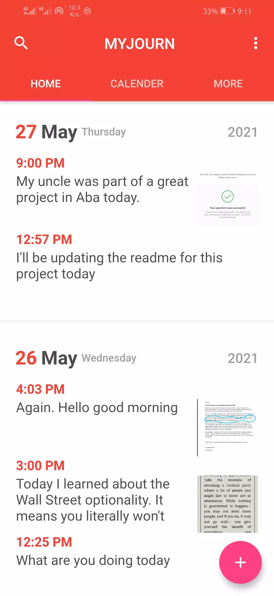

## MYJOURN

Myjourn is a feature-rich flutter application used to journal your days and save your memories.

### Features
* Cloud Backup support (**With SpringBoot backend**)
* Offline Support
* Speech to Text
* Multiple themes
* Advanced calender support

### Screenshots

